* #### For installation process on ubuntu-12.04:[Click Here](PHP-tutorial-12.04.md)

* #### For installation process on ubuntu-14.04:[Click Here](PHP-tutorial-14.04.md)

* #### For installation process on ubuntu-16.04:[Click Here](PHP-tutorial-16.04.md)

* #### For sample hello-world app:[Click Here](hello-world.md)


# <p align="center"> PHP INSTALLATION ON UBUNTU-12.04</p>

#### What is PHP?

 PHP is a open source, interpreted and object-oriented scripting language i.e. executed at server side. It is used to develop web applications (an application i.e. executed at server side and generates dynamic page).

* PHP is a server side scripting language.

* PHP is an interpreted language, i.e. there is no need for compilation.

* PHP is an object-oriented language.

* PHP is an open-source scripting language.

* PHP is simple and easy to learn language.

* PHP runs on various platforms (Windows, Linux, Unix, Mac OS X, etc).

#### Main features of PHP:


1. Performance: Script written in PHP executes much faster then those scripts written in other languages such as JSP & ASP.

2. Open Source Software: PHP source code is free available on the web, you can developed all the version of PHP according to your requirement without paying any cost.

3. Platform Independent: PHP are available for WINDOWS, MAC, LINUX & UNIX operating system. A PHP application developed in one OS can be easily executed in other OS also.

4. Compatibility: PHP is compatible with almost all local servers used today like Apache, IIS etc.

5. Embedded: PHP code can be easily embedded within HTML tags and script.

First, we need to update our local package index to make sure we have a fresh list of the available packages. Then we can install the necessary components.

```$ apt-get update```

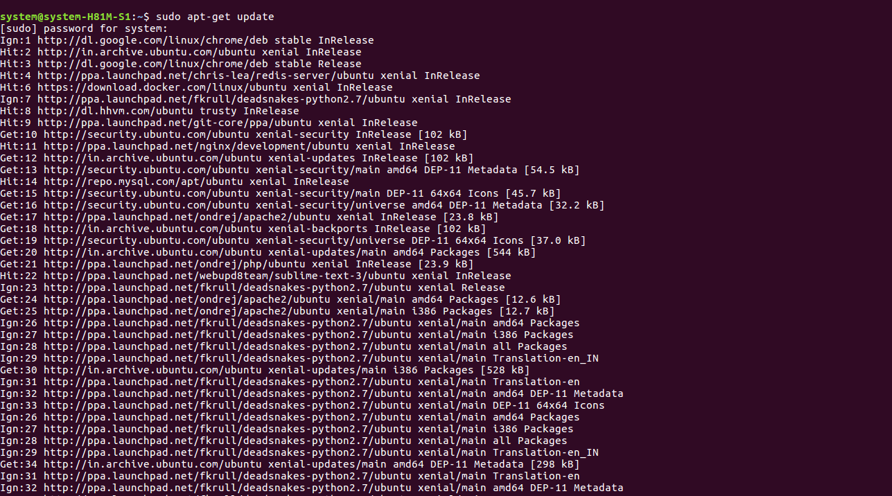

### Step-1:Installing PHP

To install PHP, first you need to install Apache and MySql.
Now download php using the below commands.
```
$ add-apt-repository ppa:ondrej/php
$ apt-get update
$ apt-get install -y php5.6 php5.6-mcrypt php5.6-gd
```

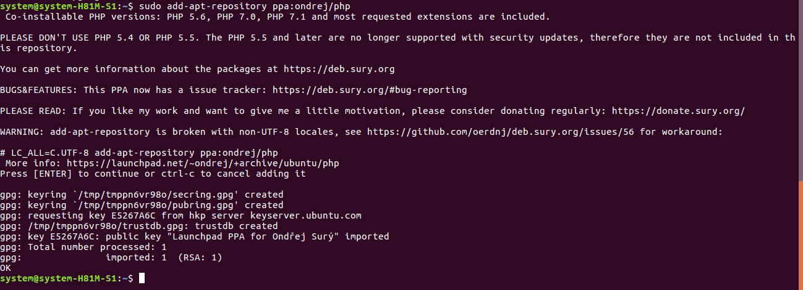

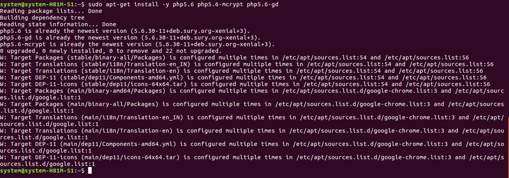

* Note:If there is an error in add-apt-repository, then try below command
```
$ apt-get install software-properties-common

or

$ apt-get install python-software-properties
```

#### What is Apache?

 Apache is the most popular Web server software. It enables a computer to host one or more websites that can be accessed over the Internet using a Web browser. Most Apache installations include a URL rewriting module called "mod_rewrite," which has become a common way for webmasters to create custom URLs.

### Step-2:Installing Apache2

To install Apache2, use the following command

```$ apt-get install apache2 libapache2-mod-php5```

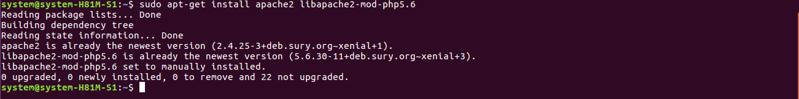

#### What is MySQL?

 MySQL is a fast, easy-to-use RDBMS being used for many small and big businesses. It handles a large subset of the functionality of the most expensive and powerful database packages.

1. MySQL uses a standard form of the well-known SQL data language.

2. MySQL works on many operating systems and with many languages including PHP, PERL, C, C++, JAVA, etc.

3. MySQL works very quickly and works well even with large data sets.

4. MySQL is very friendly to PHP, the most appreciated language for web development.

### Step-3:Installing MySQL

To install MySql, use the below command

```$ apt-get install mysql-server php5-mysql```

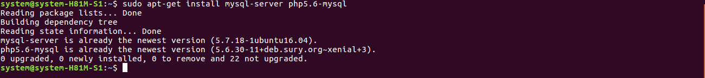

If there is any error in connecting MySql to PHP:

* Check if etc/mysql.my.cnf file has [mysqld] line.
 
#### What is Composer?

Composer is not a package Manager.It is a tool for dependency management in PHP. It allows you to declare the libraries your project depends on and it will manage (install/update) them for you.

### Step-4:Installing Composer
Install by using following commands
```
$ curl -sS https://getcomposer.org/installer | php
$ mv composer.phar /usr/local/bin/composer
$ chmod +x /usr/local/bin/composer
```
Note:If mbstring missing error occurs, then follow the below command

```$sudo apt-get install php5.6-mbstring php5.6-dom```

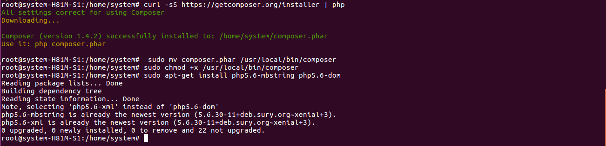

#### What is Laravel?

Laravel is a free, open-source PHP web framework, created for the development of web applications following the model–view–controller (MVC) architectural pattern. Some of the features of Laravel are a modular packaging system with a dedicated dependency manager, different ways for accessing relational databases, utilities that aid in application deployment and maintenance.

### Step-5:Installing Laravel

Now download laravel using composer.

```
$ cd /var/www
$ apt-get install git
$ git clone https://github.com/laravel/laravel.git
```
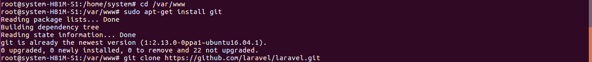

Navigate to Laravel code directory and use composer to install all dependencies required for Laravel framework.

```
$ cd /var/www/laravel
$ composer install
```

Dependencies installation will take some time. After that set proper permissions on files.

```
$ chown -R www-data.www-data /var/www/laravel
$ chmod -R 755 /var/www/laravel
$ chmod -R 777 /var/www/laravel/app/storage
```

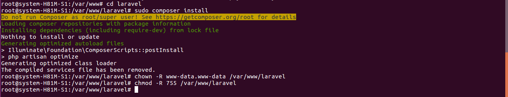

### Step-6:Set Encryption Key

Now set the 32 bit long random number encryption key, which used by the Illuminate encrypter service.

```$ php artisan key:generate```

Output may look like this: Application key [uOHTNu3Au1Kt7Uloyr2Py9blU0J5XQ75] set successfully.

Now edit config/app.php configuration file and update above generated application key as followings. Also make sure cipher is set properly.

'key' => env('APP_KEY', 'uOHTNu3Au1Kt7Uloyr2Py9blU0J5XQ75'),

'cipher' => 'AES-256-CBC',

### Step-7:local Development Server

 You have PHP installed locally and you would like to use PHP's built-in development server to serve your application, you may use the serve Artisan command. This command will start a development server at http://localhost:8000:

```$ php artisan serve```

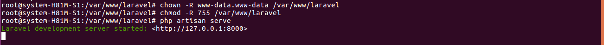

Your output will look like this

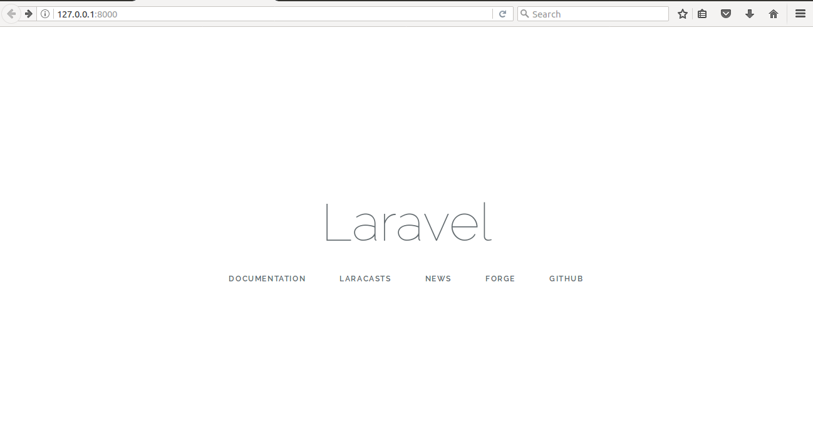

## For one click installation

* ### [Shell Script](php-12.04.sh)


# <p align="center"> PHP INSTALLATION ON UBUNTU-14.04</p>

#### What is PHP?

 PHP is a open source, interpreted and object-oriented scripting language i.e. executed at server side. It is used to develop web applications (an application i.e. executed at server side and generates dynamic page).

* PHP is a server side scripting language.

* PHP is an interpreted language, i.e. there is no need for compilation.

* PHP is an object-oriented language.

* PHP is an open-source scripting language.

* PHP is simple and easy to learn language.

* PHP runs on various platforms (Windows, Linux, Unix, Mac OS X, etc).

#### Main features of PHP:


1. Performance: Script written in PHP executes much faster then those scripts written in other languages such as JSP & ASP.

2. Open Source Software: PHP source code is free available on the web, you can developed all the version of PHP according to your requirement without paying any cost.

3. Platform Independent: PHP are available for WINDOWS, MAC, LINUX & UNIX operating system. A PHP application developed in one OS can be easily executed in other OS also.

4. Compatibility: PHP is compatible with almost all local servers used today like Apache, IIS etc.

5. Embedded: PHP code can be easily embedded within HTML tags and script.

First, we need to update our local package index to make sure we have a fresh list of the available packages. Then we can install the necessary components.

```$ apt-get update```


### Step-1:Installing PHP

To install PHP, first you need to install Apache and MySql.
Now download php using the below commands.
```
$ add-apt-repository ppa:ondrej/php
$ apt-get update
$ apt-get install -y php5.6 php5.6-mcrypt php5.6-gd
```


* Note:If there is an error in add-apt-repository, then try below command
```
$ apt-get install software-properties-common

or

$ apt-get install python-software-properties
```

#### What is Apache?

 Apache is the most popular Web server software. It enables a computer to host one or more websites that can be accessed over the Internet using a Web browser. Most Apache installations include a URL rewriting module called "mod_rewrite," which has become a common way for webmasters to create custom URLs.

### Step-2:Installing Apache2

To install Apache2, use the following command

```$ apt-get install apache2 libapache2-mod-php5```


#### What is MySQL?

 MySQL is a fast, easy-to-use RDBMS being used for many small and big businesses. It handles a large subset of the functionality of the most expensive and powerful database packages.

1. MySQL uses a standard form of the well-known SQL data language.

2. MySQL works on many operating systems and with many languages including PHP, PERL, C, C++, JAVA, etc.

3. MySQL works very quickly and works well even with large data sets.

4. MySQL is very friendly to PHP, the most appreciated language for web development.

### Step-3:Installing MySQL

To install MySql, use the below command

```$ apt-get install mysql-server php5-mysql```


If there is any error in connecting MySql to PHP:

* Check if etc/mysql.my.cnf file has [mysqld] line.
 
#### What is Composer?

Composer is not a package Manager.It is a tool for dependency management in PHP. It allows you to declare the libraries your project depends on and it will manage (install/update) them for you.

### Step-4:Installing Composer
Install by using following commands
```
$ curl -sS https://getcomposer.org/installer | php
$ mv composer.phar /usr/local/bin/composer
$ chmod +x /usr/local/bin/composer
```
Note:If mbstring missing error occurs, then follow the below command

```$sudo apt-get install php5.6-mbstring php5.6-dom```


#### What is Laravel?

Laravel is a free, open-source PHP web framework, created for the development of web applications following the model–view–controller (MVC) architectural pattern. Some of the features of Laravel are a modular packaging system with a dedicated dependency manager, different ways for accessing relational databases, utilities that aid in application deployment and maintenance.

### Step-5:Installing Laravel

Now download laravel using composer.

```
$ cd /var/www
$ apt-get install git
$ git clone https://github.com/laravel/laravel.git
```


Navigate to Laravel code directory and use composer to install all dependencies required for Laravel framework.

```
$ cd /var/www/laravel
$ composer install
```

Dependencies installation will take some time. After that set proper permissions on files.

```
$ chown -R www-data.www-data /var/www/laravel
$ chmod -R 755 /var/www/laravel
$ chmod -R 777 /var/www/laravel/app/storage
```


### Step-6:Set Encryption Key

Now set the 32 bit long random number encryption key, which used by the Illuminate encrypter service.

```$ php artisan key:generate```

Output may look like this: Application key [uOHTNu3Au1Kt7Uloyr2Py9blU0J5XQ75] set successfully.

Now edit config/app.php configuration file and update above generated application key as followings. Also make sure cipher is set properly.

'key' => env('APP_KEY', 'uOHTNu3Au1Kt7Uloyr2Py9blU0J5XQ75'),

'cipher' => 'AES-256-CBC',

### Step-7:local Development Server

 You have PHP installed locally and you would like to use PHP's built-in development server to serve your application, you may use the serve Artisan command. This command will start a development server at http://localhost:8000:

```$ php artisan serve```


Your output will look like this


## For one click installation

* ### [Shell Script](php-14.04.sh)


# <p align="center"> PHP INSTALLATION ON UBUNTU-16.04</p>

#### What is PHP?

 PHP is a open source, interpreted and object-oriented scripting language i.e. executed at server side. It is used to develop web applications (an application i.e. executed at server side and generates dynamic page).

* PHP is a server side scripting language.

* PHP is an interpreted language, i.e. there is no need for compilation.

* PHP is an object-oriented language.

* PHP is an open-source scripting language.

* PHP is simple and easy to learn language.

* PHP runs on various platforms (Windows, Linux, Unix, Mac OS X, etc).

#### Main features of PHP:


1. Performance: Script written in PHP executes much faster then those scripts written in other languages such as JSP & ASP.

2. Open Source Software: PHP source code is free available on the web, you can developed all the version of PHP according to your requirement without paying any cost.

3. Platform Independent: PHP are available for WINDOWS, MAC, LINUX & UNIX operating system. A PHP application developed in one OS can be easily executed in other OS also.

4. Compatibility: PHP is compatible with almost all local servers used today like Apache, IIS etc.

5. Embedded: PHP code can be easily embedded within HTML tags and script.

First, we need to update our local package index to make sure we have a fresh list of the available packages. Then we can install the necessary components.

```$ apt-get update```


### Step-1:Installing PHP

To install PHP, first you need to install Apache and MySql.
Now download php using the below commands.
```
$ add-apt-repository ppa:ondrej/php
$ apt-get update
$ apt-get install -y php5.6 php5.6-mcrypt php5.6-gd
```


* Note:If there is an error in add-apt-repository, then try below command
```
$ apt-get install software-properties-common

or

$ apt-get install python-software-properties
```

#### What is Apache?

 Apache is the most popular Web server software. It enables a computer to host one or more websites that can be accessed over the Internet using a Web browser. Most Apache installations include a URL rewriting module called "mod_rewrite," which has become a common way for webmasters to create custom URLs.

### Step-2:Installing Apache2

To install Apache2, use the following command

```$ apt-get install apache2 libapache2-mod-php5```


#### What is MySQL?

 MySQL is a fast, easy-to-use RDBMS being used for many small and big businesses. It handles a large subset of the functionality of the most expensive and powerful database packages.

1. MySQL uses a standard form of the well-known SQL data language.

2. MySQL works on many operating systems and with many languages including PHP, PERL, C, C++, JAVA, etc.

3. MySQL works very quickly and works well even with large data sets.

4. MySQL is very friendly to PHP, the most appreciated language for web development.

### Step-3:Installing MySQL

To install MySql, use the below command

```$ apt-get install mysql-server php5-mysql```


If there is any error in connecting MySql to PHP:

* Check if etc/mysql.my.cnf file has [mysqld] line.
 
#### What is Composer?

Composer is not a package Manager.It is a tool for dependency management in PHP. It allows you to declare the libraries your project depends on and it will manage (install/update) them for you.

### Step-4:Installing Composer
Install by using following commands
```
$ curl -sS https://getcomposer.org/installer | php
$ mv composer.phar /usr/local/bin/composer
$ chmod +x /usr/local/bin/composer
```
Note:If mbstring missing error occurs, then follow the below command

```$sudo apt-get install php5.6-mbstring php5.6-dom```


#### What is Laravel?

Laravel is a free, open-source PHP web framework, created for the development of web applications following the model–view–controller (MVC) architectural pattern. Some of the features of Laravel are a modular packaging system with a dedicated dependency manager, different ways for accessing relational databases, utilities that aid in application deployment and maintenance.

### Step-5:Installing Laravel

Now download laravel using composer.

```
$ cd /var/www
$ apt-get install git
$ git clone https://github.com/laravel/laravel.git
```


Navigate to Laravel code directory and use composer to install all dependencies required for Laravel framework.

```
$ cd /var/www/laravel
$ composer install
```

Dependencies installation will take some time. After that set proper permissions on files.

```
$ chown -R www-data.www-data /var/www/laravel
$ chmod -R 755 /var/www/laravel
$ chmod -R 777 /var/www/laravel/app/storage
```


### Step-6:Set Encryption Key

Now set the 32 bit long random number encryption key, which used by the Illuminate encrypter service.

```$ php artisan key:generate```

Output may look like this: Application key [uOHTNu3Au1Kt7Uloyr2Py9blU0J5XQ75] set successfully.

Now edit config/app.php configuration file and update above generated application key as followings. Also make sure cipher is set properly.

'key' => env('APP_KEY', 'uOHTNu3Au1Kt7Uloyr2Py9blU0J5XQ75'),

'cipher' => 'AES-256-CBC',

### Step-7:local Development Server

 You have PHP installed locally and you would like to use PHP's built-in development server to serve your application, you may use the serve Artisan command. This command will start a development server at http://localhost:8000:

```$ php artisan serve```


Your output will look like this


## For one click installation

* ### [Shell Script](php-16.04.sh)

# <p align="center"> Hello World app </p>

Let us build a sample hello world app using laravel.

* ### Step-1:

Create a new app using the below command, in the laravel directory

```$ laravel new app```

This will install all the dependencies required for the app to run, such that it takes some time.

Now your app is created.

Before creating developing the app, let us know some basics about routing.

The most basic Laravel routes simply accept a URI and a Closure, providing a very simple and expressive method of defining routes:
```
Route::get('foo', function () {
    return 'Hello World';
});
```
**The Default Route Files**

All Laravel routes are defined in your route files, which are located in the routes directory. These files are automatically loaded by the framework. The routes/web.php file defines routes that are for your web interface. These routes are assigned the web middleware group, which provides features like session state and CSRF protection. The routes in routes/api.php are stateless and are assigned the api middleware group.

For most applications, you will begin by defining routes in your routes/web.php file.

Note: In older version, laravel routes are defined directly in routes.php.

* ### Step-2:

Now open web.php which is located in he routes directory.

This may look like this
```
<?php

Route::get('/', function () {
    return view('welcome');
});
```
* ### Step-3:

Now open welcome.blade.php in the view directory, and change the code in the below styling
```
<!DOCTYPE html>
<html>
<head>
    <title></title>
</head>
<body>
<h1>Hello world</h1>
</body>
</html>
```
Note: Above styling is just an example, you can change in your own styling.

* ### Step-4:

Run the below command,

```$ php artisan serve```

This command will start a development server at http://localhost:8000: 

Your output will look like this

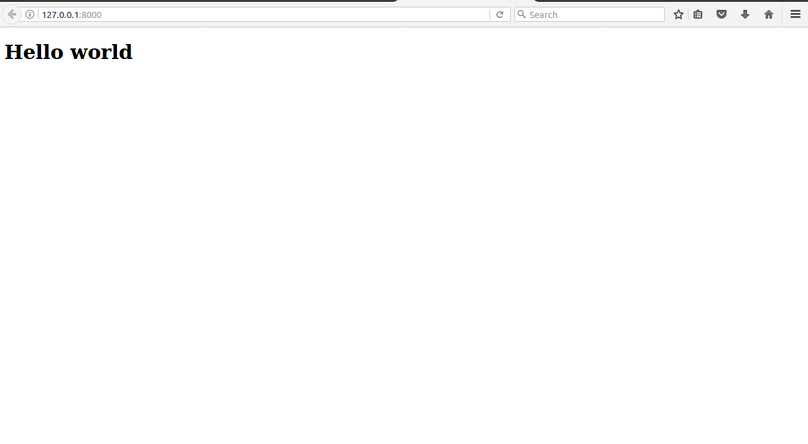

* ### Step-5:

If you want to create an other page for example 'about' page

Add the below code, after the root function
```
Route::get('about', function () {
    return view('about');
});
```
* ### Step-6:

Now create a new file in the views directory, and change the name of the file to about.blade.php then add the styling.

for example:
```
<!DOCTYPE html>
<html>
<head>
    <title></title>
</head>
<body>
<h1>About us</h1>
</body>
</html>
```
Now save the file. Make sure the file is in the views directory.

* ### Step-7:

Now start the server, by using the below command.

```$ php artisan serve```

This command will start a development server at http://localhost:8000: 

Now if you want view the about page, then change the url to http://localhost:8000/about

Your output will look like this

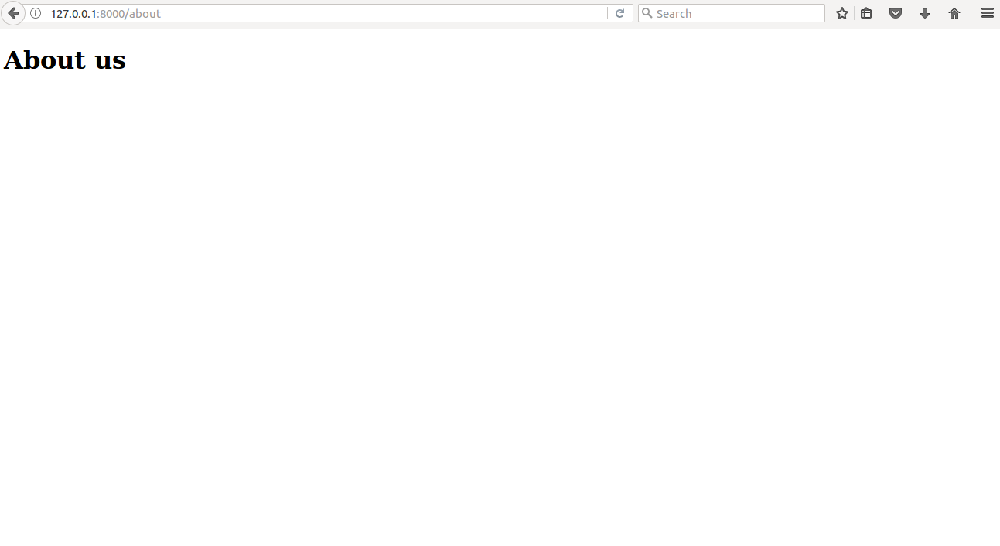

Note: If there occurs an error like Failed to listen on localhost:8000 (reason: Address already in use)

List processes with php in it

```$ ps -ef | grep php```

example output
```
501 9347 393 0 1:29PM ttys000 0:00.21 php artisan serve
501 9351 9347 0 1:29PM ttys000 0:02.01 /usr/local/php5-5.6.14-20151002-085853/bin/php -S localhost:8000 .../laravel/server.php
501 9781 393 0 1:56PM ttys000 0:00.00 grep php
```

Then kill the process, using the below command

```$ kill 9347```

if still exist then use this 

```$ sudo kill -9 9347```

Now you can serve your local using ```$ php artisan serve``` again.


